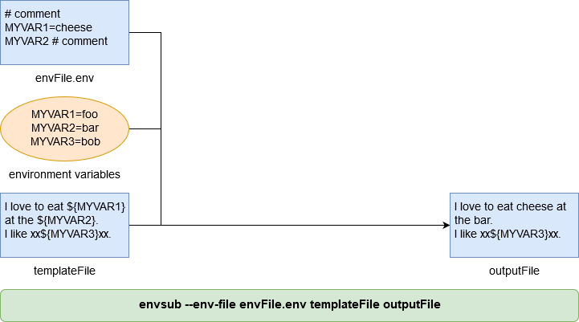
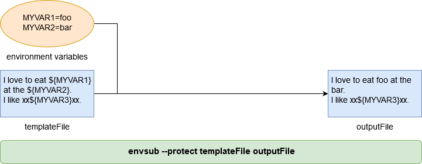
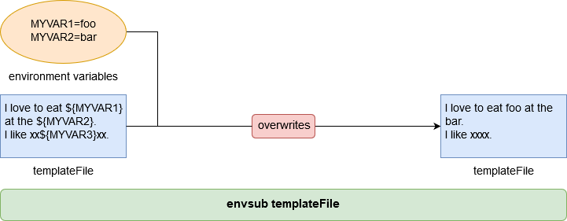
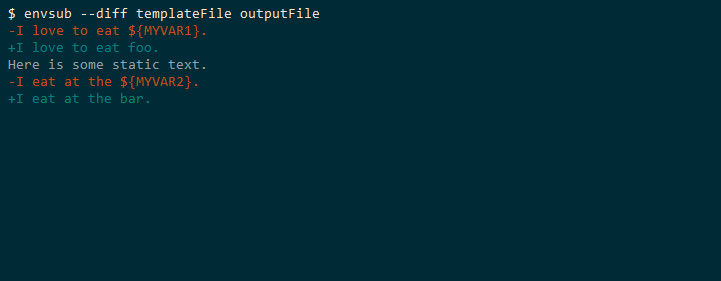
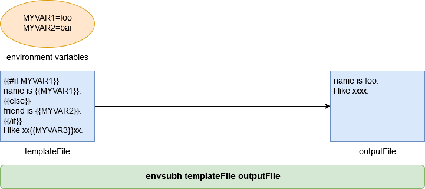
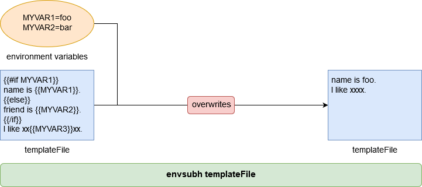
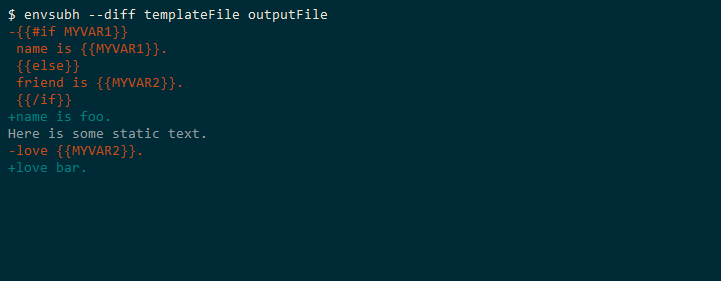

envsub is envsubst for Node.js
==============================

[](https://travis-ci.org/danday74/envsub)
[](https://coveralls.io/github/danday74/envsub?branch=master)
[](https://david-dm.org/danday74/envsub)
[](https://www.npmjs.com/package/envsub)
[](https://www.npmjs.com/package/envsub)

**envsub is envsubst for Node.js**, providing file-level environment variable substitution, catering for both global CLI and local promise-based usage.

envsub works with any file format - e.g. HTML, JSON, text, etc. - and has built-in .env file support.

**Requires Node.js v6 or higher.**


Contents
========

* Intro
  * [What is envsub?](#what-is-envsub)
  * [What is envsubh?](#what-is-envsubh)
* envsub
  * [Global CLI Usage](#envsub--global-cli-usage)
  * [Quick Reference / Help](#envsub--quick-reference--help)
  * [Docker Integration (optional)](#envsub--docker-integration-optional)
  * [Local Promise-based Usage](#envsub--local-promise-based-usage)
* envsubh
  * [Global CLI Usage](#envsubh--global-cli-usage)
  * [Quick Reference / Help](#envsubh--quick-reference--help)
  * [Local Promise-based Usage](#envsubh--local-promise-based-usage)
* Finally
  * [Environment variable naming conventions](#environment-variable-naming-conventions)
  * [Author says](#author-says)


Intro
=====

What is envsub?
---------------

Given a template file, envsub performs **environment variable substitution** and saves the result to an output file.

envsub has **flags / options** to:
 
* restrict which environment variables are substituted and
* choose template substitution syntax - e.g. ${MYVAR} or {{MYVAR}} or etc.

What is envsubh?
----------------

envsubh is automatically installed when you install envsub.

Given a template file, envsubh performs **[handlebars](https://www.npmjs.com/package/handlebars) template rendering using environment variables as data** and saves the result to an output file.

<br>

[](#envsub-is-envsubst-for-nodejs)

<br><br>


envsub > Global CLI Usage
=========================

```bash
npm install -g envsub
```

examples
--------

<br>

#### **envsub basic usage** .. ```envsub templateFile outputFile```


> By default, all environment variables are substituted.

<br><br>

#### **envsub --env flag** .. ```envsub --env MYVAR1 --env MYVAR2=station templateFile outputFile```


> Repeatable flag to restrict which environment variables are substituted. In the example, only MYVAR1 and MYVAR2 are substituted.
>
> Optionally --env can provide an overriding value. In the example, MYVAR2 is substituted in this manner.

<br><br>

#### **envsub --env-file flag** .. ```envsub --env-file envFile.env templateFile outputFile```



> Repeatable flag to load environment variables from an .env file.
>
> Given the contents of **envFile.env** the example command given is equivalent to:
>
> ```envsub --env MYVAR1=cheese --env MYVAR2 templateFile outputFile```
>
> Supported .env file syntax follows:

```
# example comment
MYVAR1               # same as --env MYVAR1
export MYVAR2        # same as --env MYVAR2
MYVAR3=hello         # same as --env MYVAR3=hello
export MYVAR4=hello  # same as --env MYVAR4=hello
```

<br><br>

#### **envsub --protect flag** .. ```envsub --protect templateFile outputFile```



> Protect non-existent environment variable placeholders from being substituted with an empty string.
>
> In the example, MYVAR3, because it does not exist, is protected from substitution.

<br><br>

#### **envsub --syntax flag** .. ```envsub --syntax handlebars templateFile outputFile```


> Template substitution syntax, one of:
> 
> * dollar-basic ```$MYVAR```
> * dollar-curly ```${MYVAR}```
> * dollar-both ```$MYVAR and ${MYVAR}```
> * handlebars ```{{MYVAR}}```
> * default ```${MYVAR}```

<br><br>

#### **envsub --system flag** .. ```envsub --env MYVAR1 --env MYVAR2=station --system templateFile outputFile```


> Prefer system environment variables.
>
> In the example, MYVAR2 would normally be overridden with the value 'station' because of ```--env MYVAR2=station```.
>
> However, because the --system flag is set, the system environment variable value 'bar' is preferred.

<br><br>

#### **envsub overwrite** .. ```envsub templateFile```



> ```envsub templateFile``` is shorthand for ```envsub templateFile templateFile```
> 
> Here, the template file is overwritten. This seemingly destructive command is useful in the docker world.
>
> After copying a template file into a docker image, it is useful to overwrite the copied file with its substituted equivalent.

<br><br>

#### **envsub --diff flag** .. ```envsub --diff templateFile outputFile```



> Log the difference between the template file and the output file.

<br>

[](#envsub-is-envsubst-for-nodejs)

<br><br>


envsub > Quick Reference / Help
===============================

```bash
envsub --help
```

```text
  Usage: envsub [options] <templateFile> [outputFile]

  Options:

    -h, --help                output usage information
    -V, --version             output the version number
    -d, --diff                show diff between template file and output file
    -e, --env <name>[=value]  environment variable to substitute .. if none specified then substitute all (but see --env-file) .. this flag can be repeated
    -f, --env-file <envFile>  load environment variables from an .env file .. this flag can be repeated
    -p, --protect             protect non-existent environment variable placeholders (that would otherwise be substituted) .. do not substitute them with an empty string
    -s, --syntax <syntax>     template substitution syntax, one of .. dollar-basic $MYVAR .. dollar-curly ${MYVAR} .. dollar-both $MYVAR and ${MYVAR} .. handlebars {{MYVAR}} .. default ${MYVAR}
    -S, --system              prefer system environment variables

  Examples:

    Typical usage
    -------------
    $ envsub templateFile outputFile
    $ envsub --diff --env MYVAR1 --env MYVAR2=foo --env-file envFile.env --protect --syntax dollar-both --system templateFile outputFile

    Overwrite your template file
    ----------------------------
    After copying a template file into a docker image, it is useful to overwrite the copied file with its substituted equivalent.
    $ envsub templateFile
    $ envsub -d -e MYVAR1 -e MYVAR2=foo -f envFile.env -p -s dollar-both -S templateFile
```

<br>

[](#envsub-is-envsubst-for-nodejs)

<br><br>


envsub > Docker Integration (optional)
======================================

envsubst is recognised by [NGINX](https://hub.docker.com/_/nginx) as a Docker templating solution.

This module seeks to make envsubst freely available to the Node.js community for Docker templating.

In both examples below the file ```./files/public/index.html``` is a template file.

Build time templating / env substitution
----------------------------------------

Sample build time [Dockerfile](https://github.com/danday74/envsub/tree/master/Dockerfiles/build)

```docker
docker build --build-arg MY_NAME=Daniel -t danday74/envsub-build-example .
docker run --name envbuild -d -p "8080:8080" danday74/envsub-build-example
```

Run time templating / env substitution
--------------------------------------

Sample run time [Dockerfile](https://github.com/danday74/envsub/tree/master/Dockerfiles/run)

```docker
docker build -t danday74/envsub-run-example .
docker run --name envrun1 -d -e MY_NAME=Daniel -p "8081:8080" danday74/envsub-run-example
docker run --name envrun2 -d -e MY_NAME=Jimbob -p "8082:8080" danday74/envsub-run-example
```

<br>

[](#envsub-is-envsubst-for-nodejs)

<br><br>


envsub > Local Promise-based Usage
==================================

```bash
npm install --save envsub
```

Local promise-based options are a perfect reflection of global CLI flags.

```javascript
const envsub = require('envsub');

let templateFile = `${__dirname}/templateFile`;
let outputFile = `${__dirname}/outputFile`;
let options = {
  diff: false, // see --diff flag
  envs: [
    {name: 'MYVAR1'}, // see --env flag
    {name: 'MYVAR2', value: 'station'} // see --env flag
  ],
  envFiles: [
    `${__dirname}/envFile.env` // see --env-file flag
  ],
  protect: false, // see --protect flag
  syntax: 'default', // see --syntax flag
  system: true // see --system flag
};

// create (or overwrite) the output file
envsub({templateFile, outputFile, options}).then((envobj) => {
  // output file created
  console.log(envobj.templateFile);
  console.log(envobj.templateContents);
  console.log(envobj.outputFile);
  console.log(envobj.outputContents);
}).catch((err) => {
  console.error(err.message);
});
```

Refer to [Global CLI Usage](#envsub--global-cli-usage) or [Quick Reference / Help](#envsub--quick-reference--help) for details about flags / options.

<br>

[](#envsub-is-envsubst-for-nodejs)

<br><br>


envsubh > Global CLI Usage
==========================

```bash
npm install -g envsub # yes, this also globally installs envsubh
```

examples
--------

<br>

#### **envsubh basic usage** .. ```envsubh templateFile outputFile```



> envsubh performs file-level handlebars template rendering using environment variables as data.
>
> All handlebars templating code is valid, so feel free to use [conditional IF statements](http://handlebarsjs.com/builtin_helpers.html) and more as per the example.
>
> To leverage full power refer to the [handlebars](https://www.npmjs.com/package/handlebars) docs.

<br><br>

#### **envsubh overwrite** .. ```envsubh templateFile```



> See [envsub overwrite](#envsub-overwrite--envsub-templatefile) for details.

<br><br>

#### **envsubh --diff flag** .. ```envsubh --diff templateFile outputFile```



> Log the difference between the template file and the output file.

<br>

[](#envsub-is-envsubst-for-nodejs)

<br><br>


envsubh > Quick Reference / Help
================================

```bash
envsubh --help
```

```text
  Usage: envsubh [options] <templateFile> [outputFile]

  Options:

    -h, --help     output usage information
    -V, --version  output the version number
    -d, --diff     show diff between template file and output file

  Examples:

    Typical usage
    -------------
    $ envsubh templateFile outputFile
    $ envsubh --diff templateFile outputFile

    Overwrite your template file
    ----------------------------
    After copying a template file into a docker image, it is useful to overwrite the copied file with its substituted equivalent.
    $ envsubh templateFile
    $ envsubh -d templateFile
```

<br>

[](#envsub-is-envsubst-for-nodejs)

<br><br>


envsubh > Local Promise-based Usage
===================================

```bash
npm install --save envsub # yes this is correct, see require statement below
```

Local promise-based options are a perfect reflection of global CLI flags.

```javascript
const envsubh = require('envsub/envsubh');

let templateFile = `${__dirname}/templateFile`;
let outputFile = `${__dirname}/outputFile`;
let options = {
  diff: false // see --diff flag
};

// create (or overwrite) the output file
envsubh({templateFile, outputFile, options}).then((envobj) => {
  // output file created
  console.log(envobj.templateFile);
  console.log(envobj.templateContents);
  console.log(envobj.outputFile);
  console.log(envobj.outputContents);
}).catch((err) => {
  console.error(err.message);
});
```

Refer to [Global CLI Usage](#envsubh--global-cli-usage) or [Quick Reference / Help](#envsubh--quick-reference--help) for details about flags / options.

<br>

[](#envsub-is-envsubst-for-nodejs)

<br><br>


Finally
=======

Environment variable naming conventions
---------------------------------------

envsub enforces the [Open Group Environment Variable Definition](http://pubs.opengroup.org/onlinepubs/000095399/basedefs/xbd_chap08.html) which states:

> Environment variable names ... consist solely of uppercase letters, digits, and the '_' ... and do not begin with a digit.

envsub also permits lowercase letters.

The regex employed for environment variable name matching is:

```[a-zA-Z_]+[a-zA-Z0-9_]*```

<br>

[](#envsub-is-envsubst-for-nodejs)

<br>


---
---

Author says
-----------

Hope this module proves useful out there.

**Now to him who is able to keep you from stumbling and to present you blameless before the presence of his glory with great joy, to the only God, our Savior, through Jesus Christ our Lord, be glory, majesty, dominion, and authority, before all time and now and forever. Amen. [Jude 24-25](https://www.biblegateway.com/passage/?search=Jude&version=ESV)**
